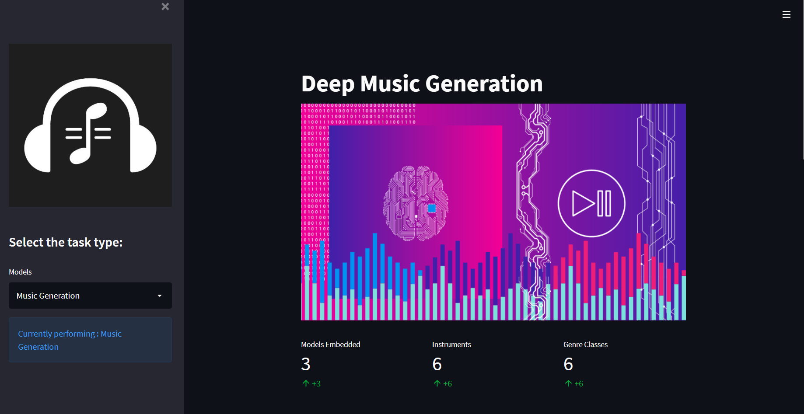

# DeepMusicGeneration

Exploring endless possiblilties to generate music using deep learning!  

[**Sample outputs**](https://drive.google.com/drive/folders/18_Ze8gJir6F3feQV6egZzNdmrrLYTYh8?usp=sharing) | [**Video demo**](https://player.vimeo.com/video/709351568?h=8ea1cae660&amp;badge=0&amp;autopause=0&amp;player_id=0&amp;app_id=58479) | [**PDF report**](https://drive.google.com/file/d/11x6lg66kgqX9fL7dy3ZyMIyFBjW8aK-0/view?usp=sharing)  

  

## Table of Contents
* [Introduction](#intro)
* [Acknowledgements](#ackn)
* [Methodology](#methods)

    - [Preprocessing](#preproc)
    - [Models](#models)
    - [Tasks](#tasks)
* [Dataset](#dataset)
* [Training](#training)
* [Evaluation](#eval) 

    - [Pretrained models](#training)
    - [Running Streamlit app](#streamlitapp)

## Introduction <a name="intro"></a> 

Generating long pieces of music using deep learning is a challenging problem, as music contains structure at multiple timescales, from milisecond timings to motifs to phrases to repetition of entire sections. This repositary explores various techniques to manipulate and generate music pieces in MIDI asa well as RAW Audio format. This repositary aims to provide code and checkpoints for such models for end use. We also integrated everything in a web applicaiton for easier use. 

There are currently two branches in this repository:
1. `archive`: The branch contains archived notebooks with code for running Transformers on MIDI and wav files, both single and multi-instruments, it also includes samples generated by the said models.

Run the following command to clone the branch:
```
git clone -b archive --single-branch https://github.com/AniketRajpoot/DeepMusicGeneration.git
```

2. `master`: The branch includes the work done for the B-Tech project as Colab notebooks (Demo and report available at header of this README) involving learning of inter-instrument dependencies along with the objective of developing realtime applications for the purpose of assisting musicians.
Run the following command to clone the branch:
```
git clone -b master --single-branch https://github.com/AniketRajpoot/DeepMusicGeneration.git
```

## Acknowledgements <a name="ackn"></a> 

This project was made possible with previous contributions referenced below: 
<ol>
  <li> https://github.com/bearpelican/musicautobot/ </li>
  <li> https://web.mit.edu/music21/ </li>
  <li> https://streamlit.io/ </li>
</ol>

### Tasks <a name="tasks"></a>

We perform following music related tasks and also provide the code for the same : 

- [:heavy_check_mark:] [Music Generation : **Transformer-XL**](Text_classification_code/)  
- [:heavy_check_mark:] [Music Remixing : **MusicBERT**](Brand_and_sentiment_identification_code/)  
- [:heavy_check_mark:] [Music Harmonization : **Seq-2-Seq Transformer**](Headline_generation_code/)  

By combining all the models in a singular pipeline, full potential of all the models can be unleashed and on can compose a complete song! 

## Methodology <a name="methods"></a> 

### Preprocessing <a name="preproc"></a>

### Models <a name="models"></a>

## Dataset <a name="dataset"></a> 

All the 3 models are pretrained using [LakhMIDI](https://colinraffel.com/projects/lmd/) dataset. Due to limited resources we were only able to train small models for music generation and music harmonization but musicBERT is a large model pretrained on the whole dataset. More about this [here](https://github.com/microsoft/muzic/tree/main/musicbert). 

## Training <a name="training"></a> 

## Evaluation <a name="eval"></a> 

### Pretrained models <a name="modellinks"></a> 

We provide pretrained checkpoints for the following models used to perform various tasks mentioned in the tasks section : 


## Running Streamlit app <a name="streamlitapp"></a> 


